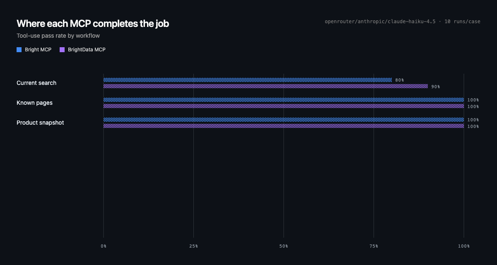
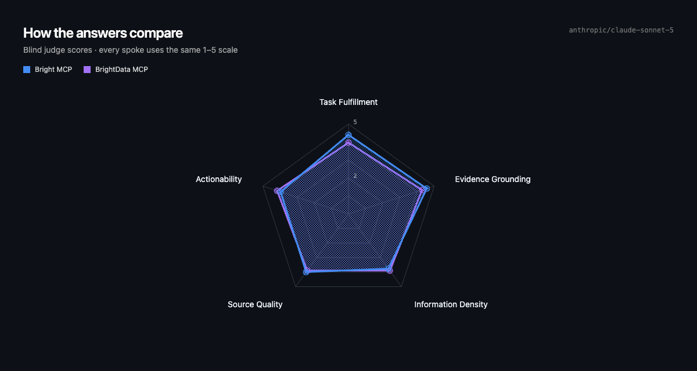
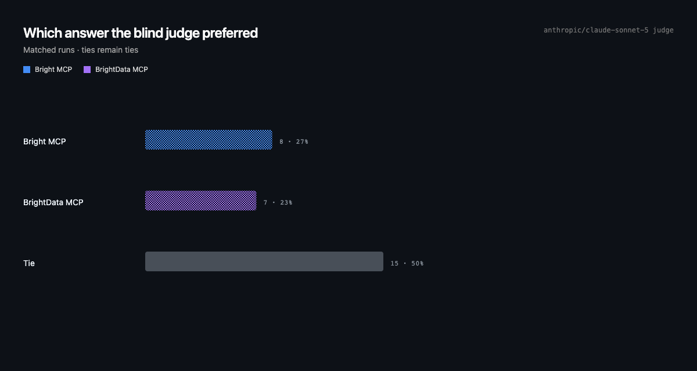
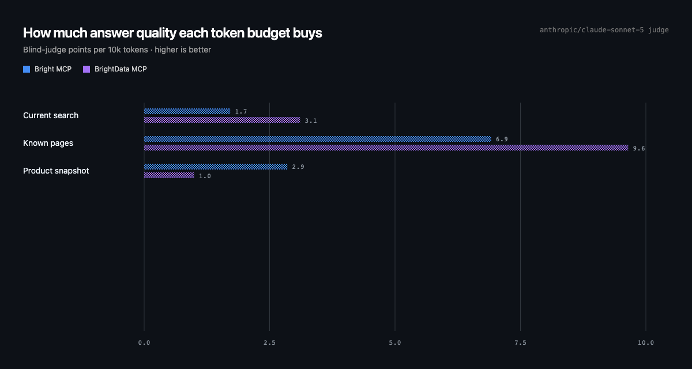
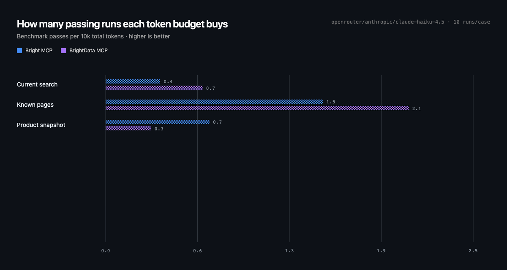
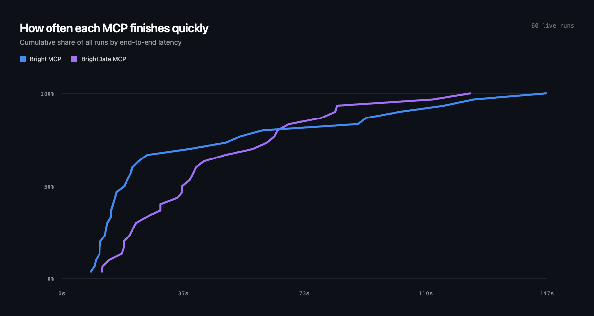
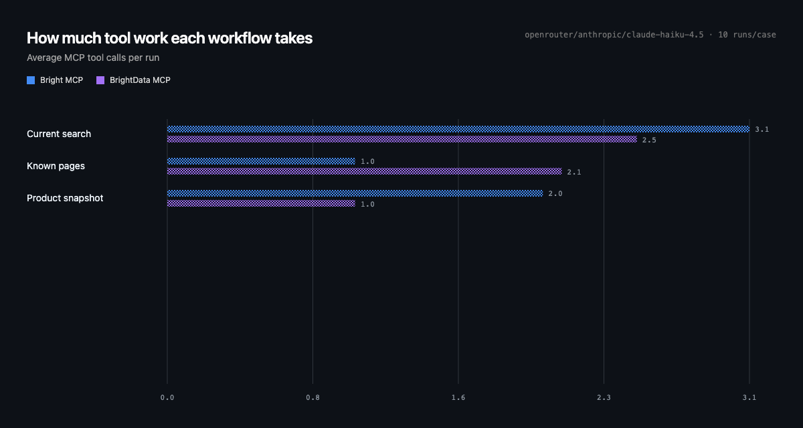

<div align="center">
  
  <br />
  <i>unofficial iteration on BrightData API served as MCP</i>
</div>

Agent-oriented Bright Data capabilities over MCP, built on Bun. The six-tool
base profile separates search, exact reading, extraction, research, maintained
dataset discovery, and execution. It pages complete pages and upstream snapshots
as resources and renders structured results in a
transient React MCP workbench.

## Install

Codex:

```bash
codex mcp add bright --url https://bright-mcp.onrender.com/mcp \
  --bearer-token-env-var BRIGHTDATA_API_KEY
```

Claude Code:

```bash
claude mcp add-json bright \
  '{"type":"http","url":"https://bright-mcp.onrender.com/mcp","headers":{"Authorization":"Bearer ${BRIGHTDATA_API_KEY}"}}'
```

Set `BRIGHTDATA_API_KEY` in the client environment first. The key is forwarded
over HTTPS and kept only in a bounded in-memory cache; Bright MCP does not
persist it. Available live capabilities follow the products enabled on that
Bright Data account.

See [SETUP.md](./SETUP.md) for local development, credentials, live checks, and
hosted authorization.

## Benchmarks

<!-- benchmark:start -->








Bright MCP: 93% pass · 4.14/5 judged quality · 14169 tokens · 19.4s p50. BrightData MCP: 97% · 4.05/5 · 16952 tokens · 37.5s p50.
Blind preference: Bright MCP 8, BrightData MCP 7, ties 15. [Method and tables](./evals/README.md#latest-tool-use-benchmark) · current-entitlements Acquire + Operate profile · `openrouter/anthropic/claude-haiku-4.5` · 10 runs/case · 2026-07-22.
<!-- benchmark:end -->

### WIP capabilities

Recurring delivery is intentionally excluded from the current benchmark score. Bright MCP can discover and run datasets, but it cannot yet create a durable refresh schedule; the case returns when it can execute delivery instead of only describing that boundary.

| Dimension | BrightData MCP | Bright MCP |
|---|---:|---:|
| Model-visible tools | 60+ maximum | 6 base / 10 browser |
| Browser tools | 14 | 4 |
| Dataset tools | One per dataset | Discovery + execution |
| Dataset catalog | Tool inventory grows with products | Caller-scoped catalog behind discovery |
| Research | Search then agent-managed scraping | Dedicated sourced research with cost gates |
| Large results | Returned through tool calls | Lazy, principal-bound snapshot resources |
| Runtime/toolchain | Node + npm + Vite | Bun-native |
| Production dependencies | 7 plus UI dependencies | Roughly 6–8, profile-dependent |
| API-specific code | Repeated across tools | Central adapters |
| Polling implementations | Repeated | One shared mechanism |
| Schema definitions | Repeated per tool | Catalog/operation-driven |
| Credentials | API key in endpoint configuration | BYOK from the client environment; never server-funded |
| Resources/tasks | Limited | First-class |
| Security/session controls | Relatively implicit | Explicit and bounded |
