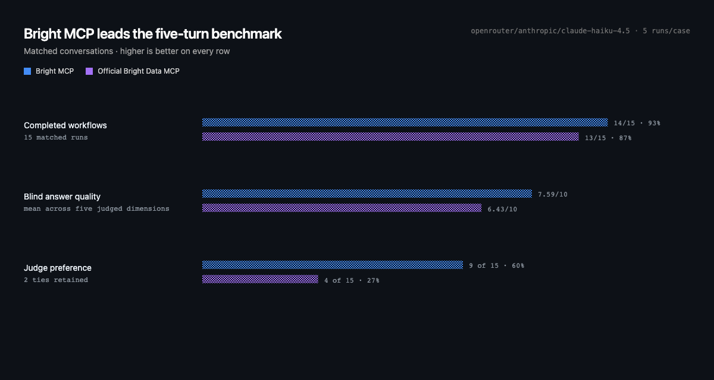

<div align="center">
  
  <br />
  <i>unofficial support for Bright Data APIs</i>
  <p>
    <a href="https://github.com/dunkeln/bright_mcp/releases"></a>
    <a href="https://github.com/dunkeln/bright_mcp/actions/workflows/ci.yml"></a>
  </p>
  <p>
    Works with <a href="#codex">Codex</a> · <a href="#claude-code">Claude Code</a> · <a href="#cursor">Cursor</a>
  </p>
</div>

Bright Data services shaped for agents, built on Bun.

The bet is not one giant tool, or the fewest possible tool calls. It is that the
model should make only the decisions where judgment adds value. Bright MCP keeps
search, source choice, reading, extraction, research, and dataset selection visible;
it internalizes deterministic plumbing such as retries, polling, pagination,
transitions, bounded previews, and partial recovery.

## Why this MCP

Bright Data's official MCP is a broad local toolbox. Bright MCP is deliberately a
smaller, caller-scoped decision surface for hosted agents. Its seven data tools are
named for outcomes rather than Bright Data product mechanics, keep credentials out
of model-visible inputs and results, and preserve large or asynchronous results as
bounded session resources.

That narrower surface is useful only when it still completes the workflow. Choose
Bright MCP when stable agent contracts, caller isolation, and predictable failure
boundaries matter. Choose the official MCP when maximum Bright Data coverage and
direct provider controls matter more. This project does not claim broader product
coverage, durable scheduling, or a replacement Bright Data control plane.

The seven-tool all profile separates search, ranked source discovery, exact reading,
extraction, research, maintained dataset discovery, and execution. It pages complete
pages and upstream snapshots as resources and renders structured results in a
transient React MCP workbench.

The full seven-tool contract remains at `/mcp`. Entitlement-aligned installs can
use stable three or two-tool surfaces at `/mcp/web`, `/mcp/deep-lookup`, or
`/mcp/marketplace`; Scraping Browser is a separate four-tool surface at
`/mcp/browser`. Tool lists never change after initialization based on a probe.

## Install

Install from [`server.json`](./server.json) in clients that support MCP Registry
remote metadata. Remote clients discover Bright MCP's OAuth flow, open the
hosted connect page, and store the resulting OAuth credential in their own
credential vault. Paste the Bright Data key once; the service keeps no
credential database and never exposes the key to the model.

### Plugin

<a id="codex"></a>
**Codex**

```bash
codex plugin marketplace add dunkeln/bright_mcp
codex plugin add bright@bright
```

Select **Authenticate** if the install does not open the connection page
automatically. Codex stores and refreshes the OAuth credential client-side.

<a id="claude-code"></a>
**Claude Code**

```bash
claude plugin marketplace add dunkeln/bright_mcp
claude plugin install bright@bright
```

Open `/mcp` and authenticate if the connection page does not open
automatically. Claude Code stores the OAuth credential client-side.

<a id="cursor"></a>
**Cursor**

Install the plugin or add `https://bright-mcp.onrender.com/mcp` as a remote
server. Cursor discovers OAuth and opens the same paste-once connection page.

### Manual header fallback

Clients without MCP OAuth may still keep `BRIGHTDATA_API_KEY` in their own
secret or environment store and send it as `X-Bright-API-Key`:

Claude Code:

```bash
claude mcp add --transport http bright https://bright-mcp.onrender.com/mcp \
  --header "X-Bright-API-Key: ${BRIGHTDATA_API_KEY}"
claude mcp add --transport http bright-browser https://bright-mcp.onrender.com/mcp/browser \
  --header "X-Bright-API-Key: ${BRIGHTDATA_API_KEY}"
```

**Cursor** (`~/.cursor/mcp.json`)

```json
{
  "mcpServers": {
    "bright": {
      "url": "https://bright-mcp.onrender.com/mcp",
      "headers": { "X-Bright-API-Key": "${env:BRIGHTDATA_API_KEY}" }
    },
    "bright-browser": {
      "url": "https://bright-mcp.onrender.com/mcp/browser",
      "headers": { "X-Bright-API-Key": "${env:BRIGHTDATA_API_KEY}" }
    }
  }
}
```

The direct key is forwarded over HTTPS for each request and is not cached or
persisted by Bright MCP.
Available live capabilities follow the products enabled on that Bright Data account.
The browser surface selects the account's sole active Browser API zone automatically. For multiple
active zones, append `?zone=<name>` once to the `bright-browser` URL.

Choose the narrowest surface your account and workflow need:

| Endpoint | Tools | Bright Data access | Authentication |
|---|---|---|---|
| `/mcp` | All seven data tools | SERP, Discover, Web Unlocker, Deep Lookup, Marketplace as used | OAuth bearer or `X-Bright-API-Key` |
| `/mcp/web` | `search_web`, `discover_web`, `read_web` | SERP + Discover + Web Unlocker | OAuth bearer or `X-Bright-API-Key` |
| `/mcp/deep-lookup` | `extract_web`, `research_web` | General Deep Lookup | OAuth bearer or `X-Bright-API-Key` |
| `/mcp/marketplace` | `find_datasets`, `run_dataset` | Account-visible Marketplace datasets | OAuth bearer or `X-Bright-API-Key` |
| `/mcp/browser` | Four `browser_*` tools | Scraping Browser | OAuth bearer or `X-Bright-API-Key`; native zone credentials resolved internally |

Choose among the seven data tools by intent:

| Sources | Needed result | Tool |
|---|---|---|
| Unknown | Compact links and summaries | `search_web` |
| Unknown, goal-constrained | Ranked source shortlist | `discover_web` |
| Known URLs | Readable page evidence | `read_web` |
| Known URLs | Exact source HTML | `read_web` with `representation: source` |
| Known URLs | Temporary named fields | `extract_web` |
| Unknown | Sourced structured records | `research_web` |
| Maintained vertical data | Typed records | `find_datasets` then `run_dataset` |

See [SETUP.md](./SETUP.md) for local development, credentials, live checks, and
hosted authorization.

## Evaluated with MCPJam

<!-- benchmark:start -->
**Test setup:** MCPJam HostRunner (`@mcpjam/sdk` 2.0.0 on Bun 1.3.14, macOS arm64) gave both MCPs the same five-turn prompts, Bright Data account credential, and `openrouter/anthropic/claude-haiku-4.5` agent through OpenRouter at temperature 0.1 for 5 runs per workflow. Runs were scheduled as matched pairs, two pairs at a time; calls within each conversation stayed sequential with a 120-second turn timeout. Each agent saw only its MCP's advertised tools and could take its own valid path to the same requested output. `anthropic/claude-sonnet-5` then judged anonymized answers against their tool evidence, with a label-swap check for position bias.



**In this five-turn snapshot, Bright MCP leads the product outcomes:** 14/15 completed workflows, 7.59/10 blind quality, and a 9–4 judge preference win. Bright is the guided route: typed outcomes, bounded handoffs, and mechanics handled inside the MCP. The official MCP is the broader toolbox, which is better when coverage and direct provider control matter more than guidance.


Bright's structured evidence and explicit provenance made it easier for the model to build a complete, grounded answer across turns. The official MCP still slightly won Known Pages quality, which fits its strong direct scrape-and-clean architecture.


The blind judge preferred Bright MCP 9 times versus 4 for the official MCP, with 2 ties. Bright won Marketplace 5–0; the official MCP won Known Pages 2–1 with 2 ties. That split is useful: Bright's typed workflow helped on multi-step data retrieval, while the official MCP's direct scraper was highly competitive on known URLs.


Successful Search was effectively tied, with the official MCP slightly ahead; Known Pages tied; Bright led Marketplace. The official MCP benefits from a shorter direct search-and-scrape path, while Bright accepts more internal machinery for recovery, batching, and typed transitions.


The targeted three-run Search rerun measured 80,628 tokens for Bright versus 169,547 for the official MCP. Bright fell 39% from its earlier 131,866-token baseline after readable-page normalization and stronger summary-sufficiency guidance; one run answered from compact summaries without opening pages. Search uses the new regression result, while the other rows retain the published five-run snapshot.

> Provisional: 67% label-swap agreement is below the 75% publication gate. The Search context rerun had three pairs and no judge calls, so treat it as a regression signal rather than a stable production estimate.

[Evaluation design and provisional results](./evals/README.md#current-tool-use-benchmark)
<!-- benchmark:end -->
